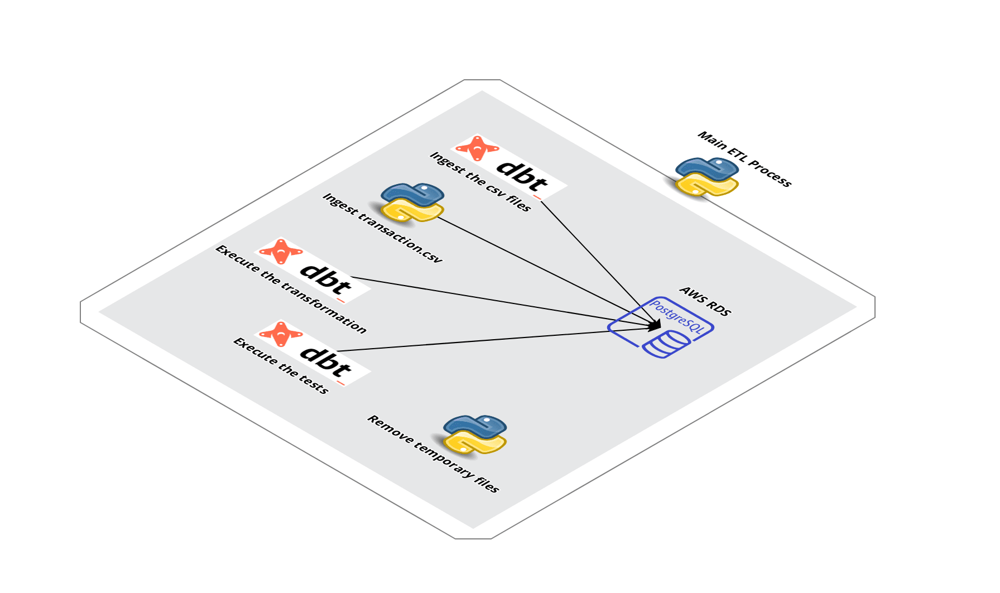

# Purchases Application processes
> This meta repo contains 2 main projects responsible for:
> 1. Ingest the raw data from transactions.csv file
> 2. Execute the full data pipeline: ingesting the transactions file data using Python + dbt process.


## Data Files used as source:

__transactions__ - contains transaction history for all customers for a period of at least 1 year prior to their offered incentive
- __id__ - A unique id representing a customer
- __chain__ - An integer representing a store chain
- __dept__ - An aggregate grouping of the Category (e.g. water)
- __category__ - The product category (e.g. sparkling water)
- __company__ - An id of the company that sells the item
- __brand__ - An id of the brand to which the item belongs
- __date__ - The date of purchase
- __productsize__ - The amount of the product purchase (e.g. 16 oz of water)
- __productmeasure__ - The units of the product purchase (e.g. ounces)
- __purchasequantity__ - The number of units purchased
- __purchaseamount__ - The dollar amount of the purchase

__offers__ - contains information about the offers
- __offer__ - An id representing a certain offer
- __category__ - The product category (e.g. sparkling water)
- __quantity__ - The number of units one must purchase to get the discount
- __company__ - An id of the company that sells the item
- __offervalue__ - The dollar value of the offer
- __brand__ -  An id of the brand to which the item belongs

The transactions file can be joined to the offers file by (category, brand, company). A negative value in productquantity and purchaseamount indicates a return.

Reference:  
https://www.kaggle.com/c/acquire-valued-shoppers-challenge/data?select=offers.csv.gz  


## Technical Description:



The project is responsible to run the full data pipeline (the Python application + dbt transformation + dbt test) as following:
1. Execute the __dbt seed__ to import the files.
2. Drop the transaction raw table if it exists.
3. Create the transaction raw table if it not exists.
4. Ingest data from the csv file stored into __/data__ folder.
5. Execute the __dbt run__ to execute the whole etl pipeline.
6. Execute the __dbt test__ to execute the tests defined for the models.
7. Remove temporary log files

Check the projects below each repository.

| Technology | Project | Description |
| ------ | ------ | ------ |
|  | [dbt_purchases_project](https://github.com/jmilhomem/dbt_purchases_project) | Project that execute the full data pipeline using dbt |
|  | [data-ingestion-purchases](https://github.com/jmilhomem/data-ingestion-purchases) | Project that ingests a large transaction csv file and executes the full data pipeline: ingests data + does the transformation for it|

## Dependencies:
Meta installed:
* Check https://github.com/mateodelnorte/meta  

To execute the full data pipeline (__data-ingestion-purchases/main_etl_processes.py__ application):
* define a base folder for projects named as __repos__
* get dbt installed 
* projects cloned
* a Postgres database instance created at AWS RDS.
* config.ini file filled and available in __~/.config__ folder (Check the data-ingestion-purchases detailed information)
* profiles.yml file filled and available in __~/.dbt__ folder (Check the dbt_purchases_project detailed information)
* python 3.6
* make  

## Run
Start your python virtualenv with ```source .venv/bin/activate```

* Run: ```make run``` to start the full ETL process as described on the [data-ingestion-purchases_project](https://github.com/jmilhomem/data-ingestion-purchases)
